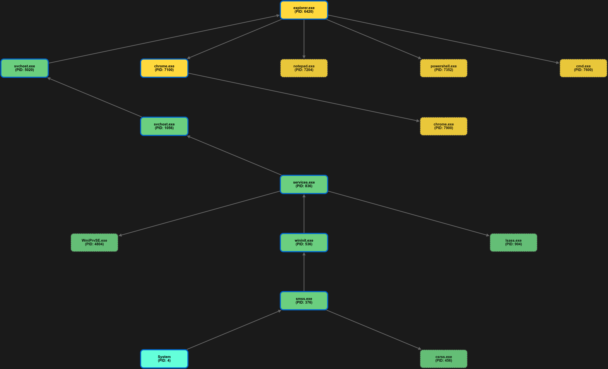

# 🧩 Volatility Process Tree Visualizer

An interactive **Flask + Cytoscape.js** web app to visualize process trees from **Volatility's `psscan` output**.  
Upload a `.txt` file containing Volatility process scan results, and the app will parse it into JSON and render an **interactive process tree diagram**.

---

## 🚀 Features
- 📂 **File Upload** – Upload Volatility `.txt` process scan files.
- 🔄 **Automatic Parsing** – Converts tab-separated process data into structured JSON.
- 🌳 **Interactive Tree Graph** – Visualize parent–child process relationships.
- 🎨 **Color-Coded Nodes** – Distinguish system, services, user apps, orphaned, and exited processes.
- 🔍 **Search & Highlight** – Find processes by name, PID, type, or memory offset.
- 🖼 **Export** – Save the visualization as a PNG snapshot.
- 📊 **Statistics Panel** – Track counts of processes, orphans, parents, and leaves.
- 🧭 **Navigation Shortcuts**:
  - `Ctrl + R` → Reset view  
  - `Ctrl + F` → Focus search bar  
  - `Ctrl + S` → Export PNG  
  - `Esc` → Clear selections  

---

## 🛠️ Tech Stack
- **Backend**: [Flask](https://flask.palletsprojects.com/) (Python)
- **Frontend**: HTML, CSS, JS
- **Visualization**: [Cytoscape.js](https://js.cytoscape.org/) + [Dagre Layout](https://github.com/dagrejs/dagre)
- **File Parsing**: Custom Python parser for Volatility output

---

## 📂 Project Structure
.
├── app.py # Flask backend

├── templates/

│ ├── upload.html # Upload page

│ ├── visualizer.html # Visualization page

├── static/

│ ├── script.js # Cytoscape rendering & logic

│ ├── upload.js # Upload handling

│ ├── styles.css # Visualization styles

│ ├── upload.css # Upload page styles

├── uploads/ # Processed uploads & JSON output

---

## ⚙️ Installation & Setup

### 1️⃣ Clone the Repository
```bash
git clone https://github.com/mustafaalkilani/volatility_visualizer.git
cd volatility-visualizer
```
2️⃣ Create Virtual Environment (optional but recommended)
```bash
python3 -m venv venv
source venv/bin/activate   # Linux/Mac
venv\Scripts\activate      # Windows
```
3️⃣ Install Dependencies
```bash
pip install flask werkzeug
```
4️⃣ Run the App
```bash
python app.py
```
Default server runs at 👉 http://127.0.0.1:5000

📖 Usage
Generate Volatility psscan output:

```bash
volatility3 -f memory.vmem windows.psscan > output.txt
```
Open the app in your browser: http://localhost:5000

Upload output.txt

Click Open Visualizer to explore the process tree.

🖼️ Demo
Upload page:

Visualization page:
  
🧪 Example JSON Output
After parsing, a .json file is created inside uploads/:

```json
[
  {
    "pid": 4,
    "ppid": 0,
    "ImageFileName": "System",
    "Threads": 146,
    "SessionId": "N/A",
    "Wow64": false,
    "CreateTime": "2025-06-21 20:13:45.000000 UTC"
  },
  ...
]
```
📝 Notes
Only .txt files are allowed.

Large files (up to 16MB) are supported.

Works with Volatility 2 & 3 psscan outputs (with PID and PPID headers).
If you don't want to run it locally. Here is a deployed version [web](https://mustafaalkilany.pythonanywhere.com/) 